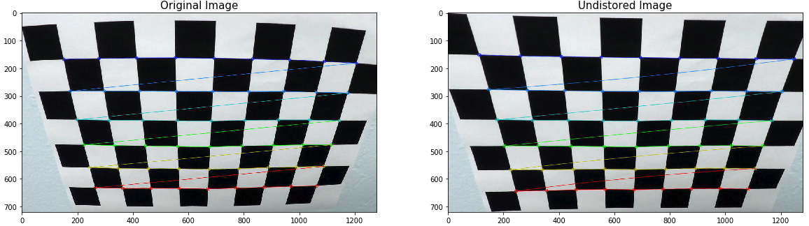
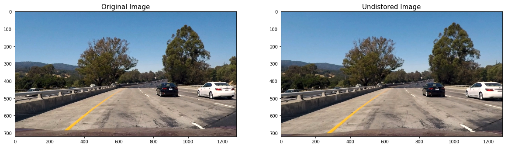
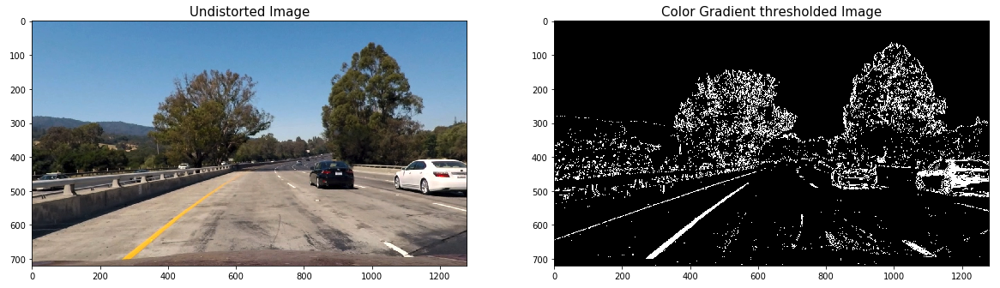
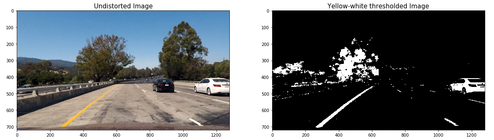
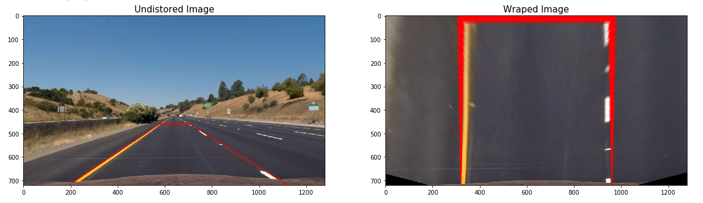
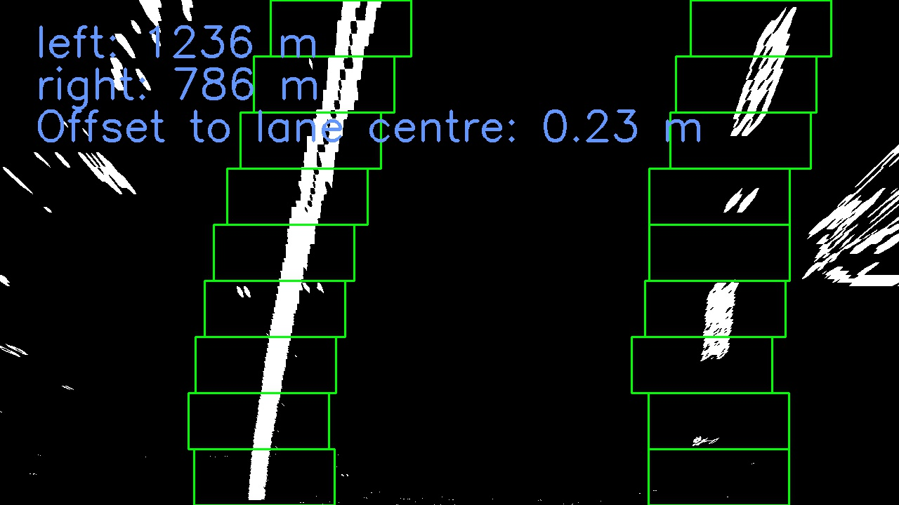
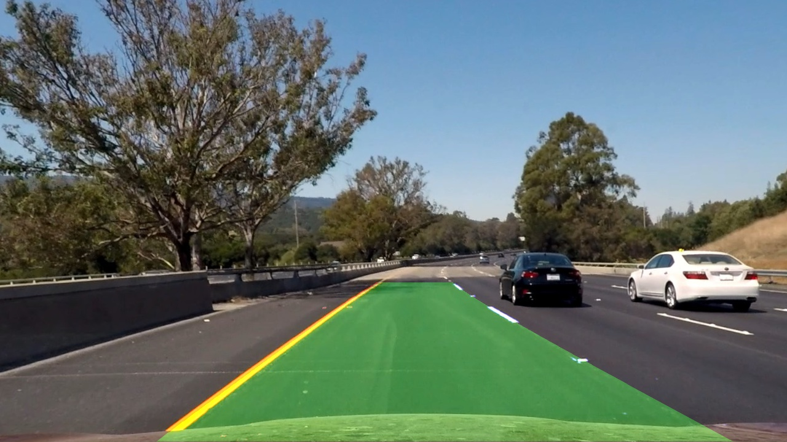
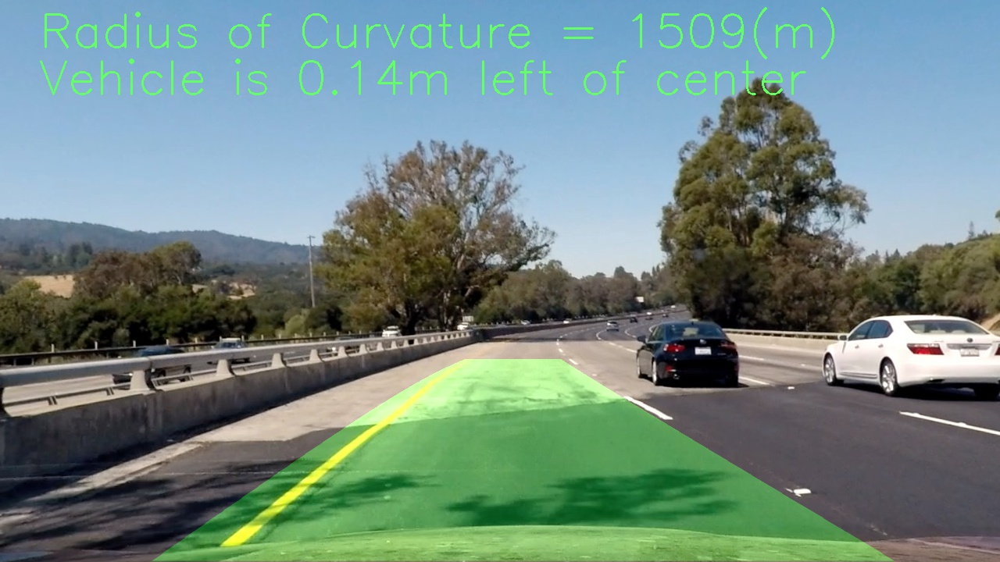

**Advanced Lane Finding Project**

Note: this is Udacity Nano Degree project, please refer to [Udacity Repository](https://github.com/udacity/CarND-Advanced-Lane-Lines.git) for the project information and requirements.

The goals / steps of this project are the following:

* Compute the camera calibration matrix and distortion coefficients given a set of chessboard images.
* Apply a distortion correction to raw images.
* Use color transforms, gradients, etc., to create a thresholded binary image.
* Apply a perspective transform to rectify binary image ("birds-eye view").
* Detect lane pixels and fit to find the lane boundary.
* Determine the curvature of the lane and vehicle position with respect to center.
* Warp the detected lane boundaries back onto the original image.
* Output visual display of the lane boundaries and numerical estimation of lane curvature and vehicle position. 

---

### Camera Calibration

#### 1. The calibrate_camera() function uses the `cv2.findChessboardCorners()` and `cv2.calibrateCamera()` funtion to implement the camera calibration.


In the function calibriate(), the process as below:

* Prepare the object points for chessboards points
* Create lists to hold the 3D object points and 2D corner pioints.
* Search corners for all calibration images.
* Calibrate camera and get calibration parameters.
* Write the calibration paramter to a pickle file *camera_cal.p*.

Here is an example of how the camera calibration parameters can be used to undistort a raw image of a chessboard:



---

### Create a lande detection pipeline

All the steps described bellow will be used in a Pipeline class that will be used to detect lanes. The purpose of each step will be demonstrated via examples and the processed results will be displayed as images. Sometimes different implementations will be discussed to achieve better results in different scenarios.


#### 1. Apply undistortion on a raw image captured by the same camera

Camera calibration parameters should have been calculated by `calibrate_camera()`, and here is how it looks like to apply undistortion with the parameters on raw images collected by the same camera:



#### 2. Threshold the image.

There are many ways to threshold an undistorted image, either in color space or using gradient decent. I have included two ways in this project: HLS space + Gradient thresholding and yellow and white thresholding.

##### 1. HLS + Sobel gradient thresholding

This is a combination of color and gradient thresholds to generate a binary image.
in color: it use a HLS's s channel, for gradient, use x direction gradient on l channel.



##### 2. Yellow and white thresholding

This is a combination of yellow-thresholding and white-thresholding to generate a binary image. Yellow high/low and white high/low need to be manually adjusted for best performance.




#### 3. Perspective transform

To implement perspective tranform, first need get the tranform parameter `M` and `Minv`.
To get the thransform parameters the `cv2.getPerspectiveTransform` function uses manully adjusted 4 source pionts and 4 destination points. I tested the parameters on `test_images/straight_lines1.jpg` using `perspective_transform()` function. The wraped binary image using the transform parameters is as following:




#### 4. Find left and right lanes and apply polynomial fit

The function `find_lane_sliding_window` uses a sliding window approach to find the lane-line pixels. 



After getting the lanes, use `np.polyfit()` to get polynomial paratmeters, this is done in `get_polynomial` in the example. To visualize the search result and fit polynomial, use `draw_lane_fit()` function to fill the gap between the two polynomial lines. Here is an example:



#### 5. Calculate the radius of curvature of the lane and the position of the vehicle with respect to center.

The cacualtion is done in the `calculate_curvature()` function and `calculate_offset()` function.

* To get curvature after getting the polynomial parameter, use the function R = (1+(2Ay+B)^2)^3/2 / (|2A|)

* For the offset, it is similar, tranfer pixel to meter, compare the lane center with picture center to get offse.


#### 6. Plot lane area and display the radius and offset.

Use `draw_lane_info()` to draw the curvature and offset on top of the undistorted image.



### Apply the pipeline to project video

#### Sanity check

Sometimes lanes are not detected correctly, I got wrong polynomial fittings like bellow:


In order to solve such problems, I checked the distance between the left and right polinomial lines at the top, middle and bottom of the image. If they fall out of a hand picked range, I ignore such fitting and just retrieve most recent valid fitting.

#### Smoothing

To stablize the detection, I made use of the `smooth_number` to just get the average of the most recent 23 valid detections. The bellow is the processed video for the complete project video.

<a href="http://www.youtube.com/watch?feature=player_embedded&v=EOUp2sg4StQ
" target="_blank"></a>


In the pipeline.py, you could go to line 487 to 498, choice test on one image or a batch of image to see how the pipeline work.
```python
if __name__ == '__main__':
	"""
	image_test_tracker(), test pipeline on one image and show the image on screen
	images_test_tracker(), test pipeline on images and write the result to related folder
	"""
	image_test_tracker("./test_images/test6.jpg", "project", debug_window=False)
	# image_test_tracker("test_images/challenge/1.jpg", "challenge", debug_window=True)
	# image_test_tracker("test_images/harder/1.jpg", "harder", debug_window=True)

	# images_test_tracker("test_images/", "output_images/", "project", debug_window=True)
	# images_test_tracker("test_images/challenge/", "output_images/challenge/", "challenge", debug_window=True)
	# images_test_tracker("test_images/harder/", "output_images/harder/", "harder", debug_window=True)
```

---

### Pipeline (video)

To apply the pipeline on the video, you could run the gen_video.py. to generate video. the option is explained in the document description.
the code is in line 66-84
```python
if __name__ == "__main__":
	"""
	choise one line to uncoment and run the file, gen the video.
	the video will be output to ./outpu_videos/temp/
	option: subclip = True, just use (0-5) second video, False, use total long video.
	option: debug_window = True, project the debug window on the up-right corner of the screen to visualize the image handle process
								and write the fit lane failure/search lane failure image to ./output_videos/temp/images
	"""
	# get_image("./test_video/challenge_video.mp4", "./test_images/challenge/", [i for i in range(1,16)])
	# get_image("./test_video/harder_challenge_video.mp4", "./test_images/harder/", [i for i in range(1,47)])

	gen_video_tracker("project_video.mp4", subclip=True, debug_window=True) 
	# gen_video_tracker("project_video.mp4", subclip=False, debug_window=False)

	# gen_video_tracker("challenge_video.mp4", subclip=True, debug_window=True) 
	# gen_video_tracker("challenge_video.mp4", subclip=False, debug_window=True)
	
	# gen_video_tracker("harder_challenge_video.mp4", subclip=True, debug_window=True)
	# gen_video_tracker("harder_challenge_video.mp4", subclip=False, debug_window=False)
```


#### 1. Pipeline issue

With the image process established on single image. We couldn't get the left/right lane correctly in whole video.
there is always noise which will affect the lane detection.

For example, in some frame, the lan detection failed, as below picuture shows


The full size picture is [link to full size picture](./examples/project_detect_fail.png)


#### 2.  add debug window on the pictures.

To solve this problem, we need to know what happed when the process not work.
so I add a function `project_debug_window()` in the class, and we also need to check the fit lane(fitted polynomial) is OK or not.
To check the lane at y postion **720/bot, 360/mid, 0/top** the lane pixel distence and project to the final result picture for debug.
build the function `lane_sanity_check()` in `lane_detection.py`

```python
	lane_distance_bot = right_fitx[720] - left_fitx[720]
	lane_distance_mid = right_fitx[320] - left_fitx[320]
	lane_distance_top = right_fitx[0] - left_fitx[0]
```

The debug picture as below, the full size could find [here]

This is done by the class "Pipeline"'s function `project_debug_window()`

(./examples/project_detect_fail_with_debug.png)


When lane detect is False. use the recent data to project the lane area and culcualte the lane radius and car offset.
one detect failure and use recent data. As below picture show


#### 3 project video

Use the `Pipeline.pipeline()`, skip the noise frame, the pipeline work well on the project_video.mp4 well.

The project video is here [project_video.mp4](./output_video/project_video.mp4).
The videos with debug window could find here [project_video_with_debug_window.mp4](./output_video/project_video_with_debug_window.mp4).


#### 4. challenge video
To solve the challenge video problem. Improve the pipeline with image process.

The challenge vidoe could be find here [challenge_video.mp4](./output_video/challenge_video.mp4).

The challenge video with debug window could be found here [challenge_video_with_debug_window](./output_video/challenge_video_with_debug_window.mp4).


#### 5. harder chanllenge
The main change of pipeline for harder_challenge compare with challenge is the image process, the search method is also changed. 

The harder challenge vidoe could be find here [harder_challenge_video.mp4](./output_video/harder_challenge_video.mp4).

The harder challenge video with debug window could be found here [harder_challenge_video_with_debug_window.mp4](./output_video/harder_challenge_video_with_debug_window.mp4).

---

### Discussion

#### 1. the time/efficiency issue

`find_lane_pixels()` (helpers/lane_detection.py) is used to search the whole warped image to find the lane pionts.

The pipeline handle the image off-line, so not consider the efficiency issue. In real application, the pipeline must hanle the image before the next image arrive. a quick search method should be applied. 

#### 2. lane_sanity check
The `lane_sanity_check()` (helpers/lane_detection.py) function is very simple. To check if the fitted polynomial lines, just compare the fitted lines three y postions x distence to check if the fitted lines is OK. this is not work very well when the lane curve change dramticlly just like the in the harder_challenge video.

---

### Folders and Files

* **camera_cal** the code which calibration the camera
* **examples** some example pictures
* **helper** all the functions which used in **pipeline.py** and **video.py**
* **output_images** the images which processed by diff function.
* **output_video** the video has finished
* **test_images** the images used to test the pipeline
* **test_video** three video for testing the lane detection

* **pipeline.py** the code which use to hande the images. the actual lane dection happend.
* **requirements.txt** the python package list in local machine
* **gen_video.py** the code with use "pipeline" to handle the vidoe and generate the output video.